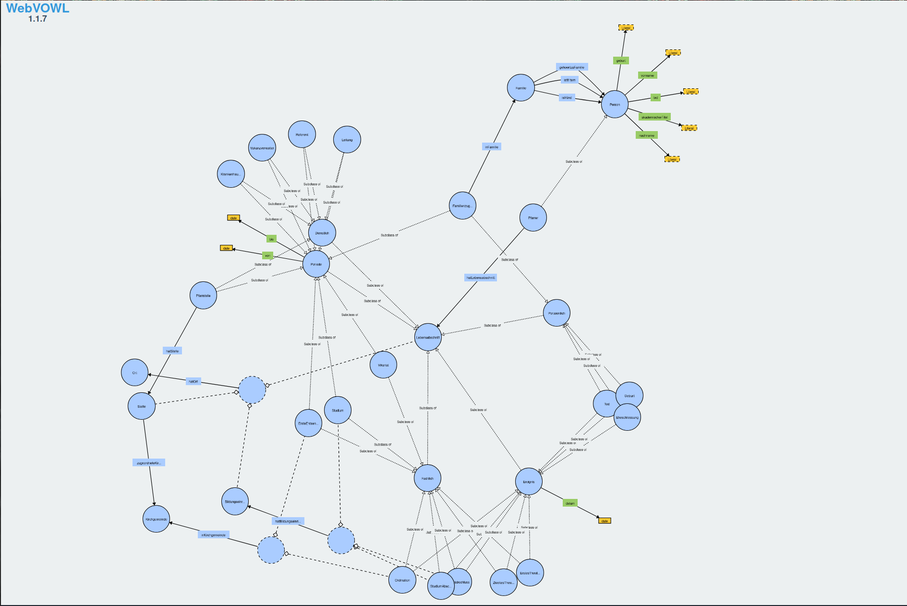

# Pfarrerbuchmodell des Meta-Pfarrerbuchprojektes

## Documentation

* https://meta-pfarrerbuch.evangelische-archive.de/info/vocabulary/index-de.html

## Visualisierung

* https://service.tib.eu/webvowl/#iri=https://raw.githubusercontent.com/pcp-on-web/pfarrerbuch-modell/main/ontology.ttl

  

